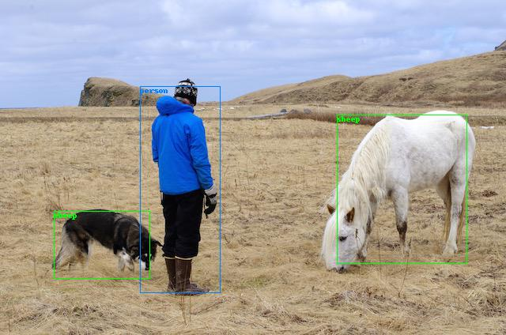

# PyTorch-YOLO

Author: Rui Wang, Yiyun Yao

Implement YOLO(You Only Look Once) using PyTorch.

## TODO
- [x] Tiny-YOLO arch with weights loading
- [x] IOU
- [x] NMS
- [x] Draw bounding box
- [x] Detection

## Description of Files

- demo.py: Demonstrate the trained YOLO algorithm in real-time using OpenCV
- utils.py: Provide data preparation function to convert the original data to the training data.
- model/tinyyolo.py: The YOLO CNN network using PyTorch

## Result

